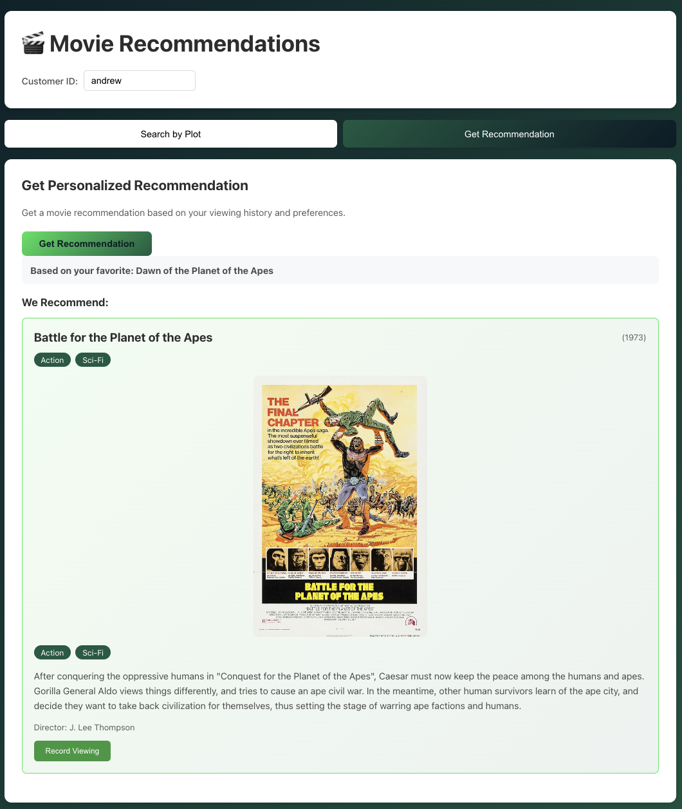

# MongoDB Movie Recommendation Engine
The purpose of the code in this repo is to demonstrate how to build a recommendation engine using Voyage AI and MongoDB Atlas.

This repository includes both a backend API (Node.js/Express) and a frontend web application (React) for searching movies and getting personalized recommendations.

## Endpoints
The application provides these 4 endpoints:
- `GET movie`. Provide query parameters for `id` (`_id` of the document in the `movies` collection) and for `secret` (must match the value set in the backend). Returns the movie details.
- `POST viewing`. Provide query parameter for `secret` (must match the value set in the backend). Body contains details of the viewing being added:

```json
{
  "customerId": "customer1",
  "movieId": "573a13c6f29313caabd73051",
  "viewedAt": "2025-11-04T13:45:26.768Z",
  "completed": true, // Did the customer watch the movie to the end?
  "rating": -1 // -1 == dislike, 0 == neutral, 1 == like
}
```

- `GET recommendation`. Provide query parameters for `customerId` (matches `_id` in the `customers` collection) and `secret` (must match the value set in the backend). Returns the details of a movie that's similar to one the customer watched recently and enjoyed.
- `POST find-by-plot`. Provide query parameter for `secret` (must match the value set in the backend). Body contains the plot description:

```json
{
  "plot": "A young farm boy discovers he has special powers and joins a rebellion to fight an evil empire in space."
}
```

Returns the top matching movie and all matches (up to 10), reranked using Voyage AI's reranking model for improved accuracy. Response includes `topMatch` (best match), `allMatches` (array of all matches with `rerankScore` and `rerankPosition`), and the original `query`.

## Prerequisites
- A MongoDB Atlas cluster [you can spin up a free MongoDB Atlas cluster following these instructions](https://www.mongodb.com/docs/atlas/tutorial/deploy-free-tier-cluster/)
- A [(free) Voyage API key](https://www.voyageai.com/)

## Preparing your database
The application works from the data in the [`movies` collection of the `sample_mflix` database that you can automatically create in MongoDB Atlas](https://www.mongodb.com/docs/atlas/sample-data/sample-mflix/).

The `movies` collection contains a document for each movie. These documents contain a `fullplot` field, and it's this data that we'll use to find similar movies. We'll generate an embedding (vector) from the `fullplot` field and then include it as a new field in the original `movies` documents.

The application automates the maintenance and creation of a new field in the `movies` collection named `fullplot_embedding` using an [Atlas Trigger](https://www.mongodb.com/docs/atlas/atlas-ui/triggers/). Whenever a document is inserted/replaced, or the `fullplot` field is updated, the trigger calls the Voyage AI API to generate a new vector/embedding from the new string, and stores it in the `fullplot_embedding` field.

### Setting up the MongoDB Atlas trigger
Start configuring the [MongoDB Atlas trigger](https://www.mongodb.com/docs/atlas/atlas-ui/triggers/) as shown here:


Note that the `Enable` toggle should be turned off at this point, as the trigger will fail until the Atlas Secret has been configured.

Continue configuring the trigger:


Note that `Event Ordering` is enabled, preventing lots of trigger invocations running in parallel.  This ensures that we don't exceed the Voyage AI free-tier rate limit when making a bulk change to `movies` collection.

Set the `Event Type` to `Function` and paste in the code from [Atlas/plotChangeTrigger.js](Atlas/plotChangeTrigger.js):


Set a Match Expression ([Atlas/triggerMatchExpression.json](Atlas/triggerMatchExpression.json)) so that the resources aren't wasted running if the movie document is updated, but the `fullplot` field hasn't been changed:


Optionally, name the trigger, and then `Save` it.

#### Define the `VOYAGE-API-KEY` Atlas secret

Return to the Triggers overview and select the "Linked App Service" link:


Select `Values` from the App Services menu and then click on "Create New Value". 

Select `SECRET`, set the name to `VOYAGE-API-KEY`, and the value to the key that you got from the [Voyage AI site](https://www.voyageai.com/) as part of the prerequisites:


To access the secret from the trigger code, it needs to be wrapped in a value (again named `VOYAGE-API-KEY`):


Return to the trigger definition and enable the trigger:


### Adding the embeddings

The trigger is now active, and so we can update `fullplot` in all of the `movies` documents, and then the trigger will asynchronously request the embedding from Voyage AI, and store it in the movie document as a new field named `fullplot_embedding`:

```js
use sample_mflix
db.movies.updateMany(
  { fullplot: { $type: "string" } },
  [
    { $set: { fullplot: { $concat: ["$fullplot", " "] } } } // Add a space to 
                                            // the end of the fullplot string
  ]
);
```

This update will complete quickly, but the triggers run sequentially and so it will take some time for `fullplot_embedding` to be set in all of the movie documents.

### Create the MongoDB Atlas vector search index

From the `mongosh` shell, create the vector search index using [`createSearchIndex`](https://www.mongodb.com/docs/manual/reference/method/db.collection.createSearchIndex/):

```js
use sample_mflix

db.movies.createSearchIndex(
  'movie-recommendation', // Name of the index
  'vectorSearch',         // It's a vector search index
  {
    "fields": [
      {
        "type": "vector",
        "path": "fullplot_embedding",  // Name of field containing the embedding
        "numDimensions": 1024,  // Number of elements in the vector (dictated
                                // by the embedding model used)
        "similarity": "cosine", // Algorithm to use to determine closeness of
                                // vectors
        "quantization": "scalar"  // Reduce the size of the vector index by converting
                                  // the floating point vector dimensions into
                                  // integers
      },
      {
        "type": "filter",   // Enable pre-filtering on the _id field
        "path": "_id"
      },
      {
        "type": "filter",  // Enable pre-filtering on the type field
        "path": "type"
      }
    ]
  }
)
```

This index can now be used to perform a vector search on the `fullplot_embedding`, as well as [pre-filtering](https://www.mongodb.com/docs/atlas/atlas-vector-search/vector-search-stage/?interface=driver&language=nodejs#std-label-vectorSearch-agg-pipeline-filter) the results on the `_id` and `type` fields.


## Running the application endpoints
### Environment variables
The application expects three environment variables to be set:
- `MONGODB_URI`. The connection string for your MongoDB Atlas cluster (including the database username and password). The IP address of the server where the endpoints will be running need to be included in the cluster's [IP Access List](https://www.mongodb.com/docs/atlas/security/ip-access-list/).
- `VOYAGE_API_KEY`. This can be the same as used for the MongoDB Atlas trigger.
- `SECRET`. This can be any value, it will be used by any application using the endpoints.

### Configuring the application
[src/config.js](src/config.js) contains all of the settings that can be customised before starting the app (database and collection names, port numbers, development mode, etc.)

### Starting the Express server
```bash
npm install
npm start
```

## Frontend Web Application

A React single-page application is included in the `frontend/` directory that provides a user-friendly interface for:
- **Searching movies by plot description** - Enter a plot and find matching movies using AI-powered vector search
- **Getting personalized recommendations** - Receive movie suggestions based on viewing history
- **Recording viewings** - Track watched movies with completion status and ratings (like/neutral/dislike)



### Running the Frontend

1. Ensure the backend server is running on `http://localhost:3000`
2. Create a `.env` file in the `frontend/` directory:

```bash
VITE_SECRET=secret123
```

(Replace `secret123` with your backend secret)

3. In a new terminal, navigate to the frontend directory and start the development server:

```bash
cd frontend
npm install
npm run dev
```

The frontend will be available at `http://localhost:5173`

For more details, see [frontend/README.md](frontend/README.md).

## Testing the endpoints
[Postman/Movies-local.postman_collection.json](Postman/Movies-local.postman_collection.json) contains a [Postman](https://www.postman.com/) collection that can be imported into Postman to test each of the endpoints.

## Key pieces of code
### Connecting the endpoints to MongoDB
Resources are consumed whenever opening a new connection to MongoDB, and so it's wasteful to do so on every invocation of an endpoint. Instead, the application does so once when the application starts (and again if/when the connection is lost). This is performed by the `getDB` function in [src/helpers/db.js](src/helpers/db.js). 

`getDB` connects to MongoDB if there isn't already a connection, but returns the existing database connection if it exists.

`getDB` is invoked when the application starts, and then whenever an endpoint is called.

### Connecting to Voyage AI
The `getVoyageClient` funtion implemented in [src/helpers/voyageai.js](src/helpers/voyageai.js) returns a client connection to the Voyage AI API.

### `POST viewing` endpoint
This is implemented in [src/endpoints/postViewing.js](src/endpoints/postViewing.js) and should be used whenever a customer watches a new movie.

The endpoint adds a new object to the customer's document `viewedMovies` array representing the movie viewing. The object contains the `_id` of the new movie, together with a flag to indicate if the customer watched the movie to the end, when they watched it, and a rating (-1 === disliked, 1 === liked, 0 === didn't express a view).

```js
{
  _id: 'customer1',
  name: { first: 'John', last: 'Doe' },
  email: 'john.doe@example.com',
  viewedMovies: [
    {
      movieId: ObjectId('573a139af29313caabcef29d'),
      viewedAt: 2025-12-02T14:25:20.580Z,
      completed: true,
      rating: -1
    },
    {
      movieId: ObjectId('573a139af29313caabcf0324'),
      viewedAt: 2025-12-02T14:25:20.580Z,
      completed: true,
      rating: 1
    },
    {
      movieId: ObjectId('573a13e3f29313caabdbfc11'),
      viewedAt: 2025-12-02T14:25:20.580Z,
      completed: true,
      rating: -1
    },
    {
      movieId: ObjectId('573a13a0f29313caabd05069'),
      viewedAt: 2025-12-02T14:25:20.580Z,
      completed: true,
      rating: 0
    },
    {
      movieId: ObjectId('573a13b8f29313caabd4cdc1'),
      viewedAt: 2025-12-02T14:25:20.580Z,
      completed: false,
      rating: 1
    },
    ...
}
```

We only want to maintain the most recent fifty movies for each customer. This is achieved using this code:

```js
await customerCollection.updateOne(
  { _id: body.customerId },
  { 
    // Add the new viewing to the start of the array, keeping only the most recent 50
    $push: { viewedMovies: { $each: [viewingRecord], $position: 0, $slice: 50 } }
  }
);
```

This single call to MongoDB atomically:
- Finds the customer document for the provided `customerId`
- Adds the new viewing as the first element in the `viewedMovies` array in that document
- Removes any elements in the array after the fiftieth element (counted *after* the new element has been added)